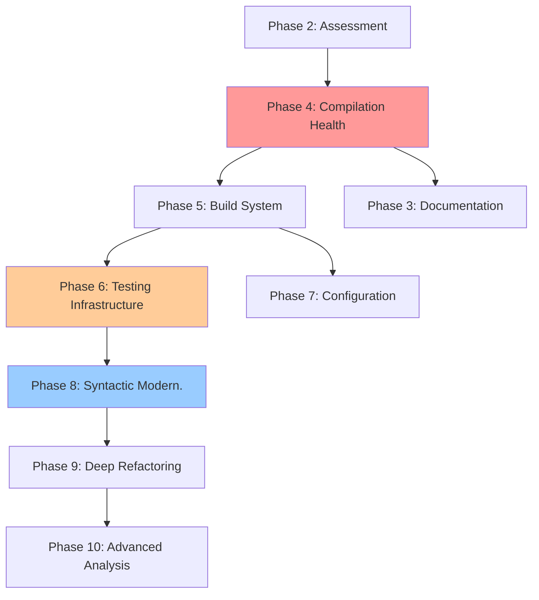

# Comprehensive Modernization Plan

**Project**: Conquer v4 - Classic Multi-Player Strategy Game
**Plan Date**: 2025-09-17
**Analyzer**: Claude Code (claude-sonnet-4@20250514)
**Based On**: System Analysis, Compilation Health, Security Analysis, and Testing Infrastructure reports

## Executive Summary

This plan outlines a systematic approach to modernizing the Conquer v4 codebase from its 1980s origins to modern C2023 standards. The modernization spans **10 distinct phases** over an estimated **6-8 weeks**, addressing critical compilation issues, security vulnerabilities, testing infrastructure, and architectural improvements while preserving the game's original functionality.

**Key Modernization Goals**:
- **Correctness**: Eliminate compilation errors and undefined behavior
- **Security**: Address buffer overflows and authentication vulnerabilities
- **Portability**: Ensure POSIX compliance across target platforms
- **Maintainability**: Improve code documentation and testing infrastructure
- **Performance**: Maintain or improve game performance characteristics

## Phase Overview and Timeline

| Phase | Focus Area | Duration | Dependencies | Deliverables |
|-------|------------|----------|--------------|--------------|
| **1** | Environment Setup | 1 day | None | Git repo, directory structure |
| **2** | Assessment & Planning | 2-3 days | Phase 1 | Analysis reports, modernization plan |
| **3** | Documentation | 5-7 days | Phase 2 | Comprehensive function documentation |
| **4** | Compilation Health | 4-6 days | Phase 2 | Zero compilation errors/warnings |
| **5** | Modern Build System | 2-3 days | Phase 4 | CMake build system |
| **6** | Testing Infrastructure | 9-14 days | Phase 5 | Unity testing framework |
| **7** | Configuration Modern. | 2-3 days | Phase 5 | Feature detection system |
| **8** | Syntactic Modern. | 6-8 days | Phase 6 | ANSI C compliance, safety |
| **9** | Deep Refactoring | 5-7 days | Phase 8 | Portability, type safety |
| **10** | Advanced Analysis | 3-5 days | Phase 9 | Static/dynamic analysis |

**Total Estimated Duration**: 39-59 days (6-8 weeks)

## Detailed Phase Implementation

### Phase 1: Triage and Environment Setup ✅ COMPLETED
**Duration**: 1 day
**Status**: ✅ COMPLETED

**Completed Work**:
- ✅ Created `_modernization/` directory structure
- ✅ Established project under Git version control
- ✅ Set up modern development environment

**Deliverables**:
- Project directory structure
- Git repository with proper `.gitignore`
- Development environment preparation

---

### Phase 2: Initial Assessment and Planning ✅ COMPLETED
**Duration**: 2-3 days
**Status**: ✅ COMPLETED

**Completed Analysis**:
- ✅ **System Analysis**: 32 C files, 25,564 lines, multi-user strategy game
- ✅ **Compilation Health**: 7,674+ warnings/errors, blocking issues identified
- ✅ **Security Analysis**: 280+ unsafe string operations, critical vulnerabilities
- ✅ **Testing Infrastructure**: No formal testing, comprehensive framework needed

**Deliverables**:
- ✅ `_modernization/claude/reports/SYSTEM_ANALYSIS.md`
- ✅ `_modernization/claude/reports/COMPILATION_HEALTH.md`
- ✅ `_modernization/claude/reports/SECURITY_FIXES.md`
- ✅ `_modernization/claude/reports/TESTING_INFRASTRUCTURE.md`
- ✅ `_modernization/claude/reports/MODERNIZATION_PLAN.md` (this document)

---

### Phase 3: Comprehensive Documentation 📝
**Duration**: 5-7 days
**Status**: 🔄 NEXT PHASE
**Approach**: One file per session, immediate git commits

#### 3.1 Documentation Strategy
**File Priority Order**:
1. **Priority 1 - Core System** (2 days):
   - `main.c` - Main game loop and initialization
   - `data.h` - Primary data structures and constants
   - `header.h` - Configuration and cross-platform compatibility

2. **Priority 2 - I/O and Data Management** (1-2 days):
   - `io.c` - Input/output operations and file handling
   - `data.c` - Data manipulation functions
   - `update.c` - Turn processing and game state updates

3. **Priority 3 - User Interface** (1 day):
   - `display.c` - Screen display and curses interface
   - `forms.c` - User interface forms and dialogs
   - `commands.c` - User command processing

4. **Priority 4 - Game Logic** (1-2 days):
   - `combat.c` - Military combat mechanics
   - `magic.c` - Magic system implementation
   - `trade.c` - Economic and trading systems
   - `misc.c` - Utility functions

5. **Priority 5 - Support Files** (1 day):
   - Remaining utility and administrative files

#### 3.2 Documentation Requirements
**Standard Function Documentation Format**:
```c
/*
 * function_name - Brief one-line description
 *
 * Detailed description explaining the function's purpose,
 * algorithm, and any important implementation details.
 *
 * Parameters:
 *   param1 - Description with constraints and valid ranges
 *   param2 - Description with validation requirements
 *
 * Returns:
 *   Description of return value and error codes
 *
 * Side Effects:
 *   - Global state modifications
 *   - Memory allocation requirements
 *   - I/O operations performed
 *
 * Testing Notes:
 *   Category: A (Unit) | B (Integration) | C (System) | D (Mock) | E (Skip)
 *   Approach: [Testing strategy description]
 *   Key Tests: [Critical test scenarios]
 *   Dependencies: [Global variables, initialization requirements]
 *
 * Notes:
 *   - Thread safety information
 *   - Performance considerations
 *   - Historical context if relevant
 */
```

#### 3.3 Session Management
- **One file per session**: Complete documentation of one file before proceeding
- **Immediate commits**: Git commit after each file completion
- **Progress tracking**: Update todo list and session notes
- **Quality validation**: Ensure documentation covers all functions

---

### Phase 4: Warning Elimination and Compilation Health 🚨
**Duration**: 4-6 days
**Status**: 🔄 CRITICAL BLOCKING PHASE
**Priority**: CRITICAL - Must complete before testing or build work

#### 4.1 Critical Error Resolution (1-2 days)
**Blocking Issues to Fix**:

1. **Function Declaration Conflicts**:
   ```c
   // Remove from data.h:
   extern int access();     // Conflicts with unistd.h
   extern void exit();      // Conflicts with stdlib.h
   FILE *fopen();          // Conflicts with stdio.h
   ```

2. **Main Function Standardization**:
   ```c
   // Convert from:
   void main(argc,argv)
   int argc;
   char **argv;

   // Convert to:
   int main(int argc, char **argv)
   ```

3. **Essential Include Headers**:
   - Add missing `#include` statements
   - Remove conflicting extern declarations
   - Ensure standard library functions properly declared

#### 4.2 K&R Function Modernization (2-3 days)
**Systematic Conversion Process**:
```c
// Before (K&R style):
int process_turn(country, flags)
int country;
long flags;
{
    // function body
}

// After (ANSI C):
int process_turn(int country, long flags)
{
    // function body
}
```

**Files Requiring K&R Conversion**: All 32 C source files

#### 4.3 Warning Elimination (1 day)
**Target Warnings**:
- Format specifier warnings (printf/scanf mismatches)
- Unused variable warnings
- Implicit type conversion warnings
- Comment syntax issues

#### 4.4 Automation Scripts Creation
**Priority Scripts**:
1. **`fix_function_conflicts.py`** - Remove conflicting function declarations
2. **`convert_kr_to_ansi.py`** - Convert K&R function definitions
3. **`add_missing_includes.py`** - Add proper include statements
4. **`fix_main_functions.py`** - Standardize main function signatures

**Script Requirements**:
- Use uv shebang format for Python
- Include `--dry-run` and `--backup` options
- Implement idempotent operations
- Log all changes with timestamps

---

### Phase 5: Modern Build System 🛠️
**Duration**: 2-3 days
**Status**: 🔄 DEPENDENT ON PHASE 4

#### 5.1 CMake Implementation (1-2 days)
**Replace legacy Makefile with modern CMake**:

```cmake
cmake_minimum_required(VERSION 3.10)
project(Conquer C)

# Modern C standard
set(CMAKE_C_STANDARD 23)
set(CMAKE_C_STANDARD_REQUIRED ON)

# Strict compilation flags
set(CMAKE_C_FLAGS "${CMAKE_C_FLAGS} -Wall -Wextra -Wpedantic -D_POSIX_C_SOURCE=200809L")

# Find dependencies
find_package(Curses REQUIRED)
find_package(Threads REQUIRED)

# Main executable
add_executable(conquer
    main.c combat.c commands.c data.c display.c
    # ... all source files
)

target_link_libraries(conquer
    ${CURSES_LIBRARIES}
    Threads::Threads
    m
)
```

#### 5.2 Feature Detection (1 day)
**Replace hardcoded configurations**:
```cmake
include(CheckFunctionExists)
include(CheckIncludeFile)

check_function_exists(strnlen HAVE_STRNLEN)
check_include_file(sys/file.h HAVE_SYS_FILE_H)

configure_file(
    ${CMAKE_SOURCE_DIR}/config.h.in
    ${CMAKE_BINARY_DIR}/config.h
)
```

---

### Phase 6: Testing Infrastructure Setup 🧪
**Duration**: 9-14 days
**Status**: 🔄 CRITICAL FOR SAFE MODERNIZATION

#### 6.1 Unity Framework Setup (2-3 days)
**Framework Installation and Integration**:
```
tests/
├── framework/          # Unity testing framework
├── unit/              # Unit tests for individual functions
├── integration/       # Integration tests for modules
├── regression/        # Regression tests for modernization
├── security/          # Security-focused tests
├── performance/       # Performance benchmarks
├── fixtures/          # Test data and mock files
└── scripts/           # Test automation scripts
```

#### 6.2 Baseline Regression Testing (3-4 days)
**Critical Functions to Test**:
- Data structure validation (nation, sector integrity)
- File I/O operations (save/load cycles)
- Economic calculations (resource management)
- Combat resolution (battle mechanics)
- Turn processing (core game logic)

#### 6.3 Mock Infrastructure (2-3 days)
**Mock Systems Required**:
- Global state mocking for unit tests
- File system mocking for I/O testing
- Curses interface mocking for headless testing

#### 6.4 Security Testing Integration (1-2 days)
**Security Test Implementation**:
- Buffer overflow testing
- Input validation testing
- Authentication security testing
- File path validation testing

#### 6.5 Automation and CI/CD (1-2 days)
**Test Automation Setup**:
- Automated test runners
- Continuous integration scripts
- Test report generation
- Performance benchmarking

---

### Phase 7: Configuration Modernization 🧐
**Duration**: 2-3 days
**Status**: 🔄 DEPENDENT ON PHASE 5

#### 7.1 Configuration Audit (1 day)
**Review Current Configuration**:
- Analyze `header.h` configuration constants
- Document all build-time options
- Identify platform-specific code sections

#### 7.2 Feature Detection Implementation (1-2 days)
**Replace Manual Configuration**:
```c
// Replace manual #define with detected features
#ifdef HAVE_STRNLEN
    len = strnlen(str, maxlen);
#else
    len = manual_strnlen(str, maxlen);
#endif
```

---

### Phase 8: Syntactic and Mechanical Modernization ⚙️
**Duration**: 6-8 days
**Status**: 🔄 CORE MODERNIZATION PHASE

#### 8.1 Function Prototype Updates (2 days)
**Convert All Function Declarations**:
- Update header files with proper prototypes
- Ensure parameter types are explicit
- Add const qualifiers where appropriate

#### 8.2 Type System Improvements (2 days)
**Modernize Type Declarations**:
```c
// Before:
int process_sector();
char *name;

// After:
int process_sector(int x, int y);
const char *name = NULL;
```

#### 8.3 Memory Safety Improvements (2-3 days)
**Replace Unsafe Functions**:
```c
// Before:
strcpy(dest, src);
sprintf(buffer, format, ...);

// After:
strncpy(dest, src, sizeof(dest) - 1);
dest[sizeof(dest) - 1] = '\0';
snprintf(buffer, sizeof(buffer), format, ...);
```

#### 8.4 Standard Library Updates (1 day)
**Modern Standard Library Usage**:
- Include proper headers for all used functions
- Use POSIX-compliant function variants
- Avoid GNU extensions and BSD-specific functions

---

### Phase 9: Deep Refactoring and Integer Portability 🧠
**Duration**: 5-7 days
**Status**: 🔄 ADVANCED MODERNIZATION

#### 9.1 Integer Type Modernization (2-3 days)
**64-bit Portability Fixes**:
```c
// Before (32-bit assumptions):
int sector_count;
int army_index;

// After (64-bit safe):
size_t sector_count;
size_t army_index;
```

**Type Decision Framework**:
- **General arithmetic**: Use `int`
- **Exact bit-width**: Use `int32_t`, `uint64_t` from `<stdint.h>`
- **Memory/array operations**: Use `size_t`
- **Pointer storage**: Use `uintptr_t`

#### 9.2 Format Specifier Updates (1 day)
**Portable I/O Format Strings**:
```c
// Before:
printf("Size: %d\n", size);

// After:
printf("Size: %zu\n", size);  // For size_t
printf("Value: %" PRIu64 "\n", value);  // For uint64_t
```

#### 9.3 Modern C Features Integration (2-3 days)
**C2023 Features Where Beneficial**:
- Static assertions (`_Static_assert`)
- Generic selections (`_Generic`)
- Alignment specifiers (`_Alignas`, `_Alignof`)
- Anonymous structs and unions

---

### Phase 10: Advanced Analysis and Maintenance 🔬
**Duration**: 3-5 days
**Status**: 🔄 FINAL VALIDATION PHASE

#### 10.1 Static Analysis (1-2 days)
**Comprehensive Code Analysis**:
```bash
# Clang Static Analyzer
clang --analyze -std=c2x -D_POSIX_C_SOURCE=200809L *.c

# Cppcheck security analysis
cppcheck --enable=all --std=c23 *.c

# Clang-tidy modernization
clang-tidy *.c -checks=modernize-*,security-*
```

#### 10.2 Dynamic Analysis (1-2 days)
**Runtime Validation**:
```bash
# AddressSanitizer build
gcc -fsanitize=address -fsanitize=undefined -g *.c

# Valgrind memory analysis
valgrind --tool=memcheck --leak-check=full ./conquer

# Performance profiling
perf record ./conquer
```

#### 10.3 Cross-Platform Validation (1 day)
**Target Platform Testing**:
- **Debian Linux**: Primary development platform
- **Fedora Linux**: RPM-based distribution testing
- **macOS**: Darwin/BSD compatibility
- **FreeBSD**: Pure BSD compatibility

---

## Risk Management and Mitigation

### Critical Path Dependencies


### High-Risk Areas
1. **Compilation Health (Phase 4)**: Blocking for all subsequent work
2. **Testing Infrastructure (Phase 6)**: Critical for safe modernization
3. **Function Signature Changes**: May break function calls throughout codebase
4. **Global State Refactoring**: High complexity, potential for breaking changes

### Risk Mitigation Strategies
1. **Incremental Changes**: One category of fixes at a time
2. **Comprehensive Testing**: Validate each change with regression tests
3. **Backup Strategy**: Maintain .orig files for rollback capability
4. **Automation**: Use scripts to ensure consistency and reduce human error
5. **Documentation**: Record all changes for audit and review

## Quality Gates and Success Metrics

### Phase Completion Criteria
| Phase | Completion Criteria |
|-------|-------------------|
| **Phase 3** | All functions documented with standard format |
| **Phase 4** | Zero compilation errors/warnings with strict flags |
| **Phase 5** | CMake builds successfully on all target platforms |
| **Phase 6** | 60% unit test coverage, all regression tests pass |
| **Phase 7** | Feature detection replaces all manual configuration |
| **Phase 8** | All functions use ANSI C prototypes, safe string functions |
| **Phase 9** | 64-bit portability validated, modern types used |
| **Phase 10** | Static analysis clean, dynamic analysis passes |

### Overall Success Metrics
- **Functionality Preservation**: All original game features work identically
- **Security Improvement**: All identified vulnerabilities addressed
- **Performance Maintenance**: No significant performance degradation
- **Portability Achievement**: Successful builds on all target platforms
- **Code Quality**: Modern C standards compliance
- **Maintainability**: Comprehensive documentation and testing

## Resource Requirements

### Development Environment
- **Development Platform**: Linux (Debian/Fedora) with GCC/Clang
- **Cross-Platform Testing**: Access to macOS and FreeBSD systems
- **Analysis Tools**: Static analyzers, dynamic analysis tools, profilers
- **Version Control**: Git with proper branching strategy

### Time Investment
- **Daily Commitment**: 6-8 hours focused development time
- **Total Calendar Time**: 6-8 weeks with consistent daily progress
- **Peak Complexity Phases**: Phases 4, 6, and 8 require highest concentration
- **Documentation Time**: Significant investment in Phase 3, ongoing throughout

### Technical Skills Required
- **Legacy C Knowledge**: Understanding K&R C and pre-ANSI patterns
- **Modern C Standards**: C99/C2023 features and best practices
- **Security Awareness**: Buffer overflow prevention, secure coding
- **Testing Expertise**: Unit testing, integration testing, mocking
- **Build Systems**: CMake, cross-platform compilation
- **Analysis Tools**: Static analyzers, dynamic analysis, profilers

## Alternative Approaches Considered

### Approach 1: Big Bang Rewrite
**Rejected Reason**: High risk of functionality changes, loss of historical behavior

### Approach 2: Minimal Modernization
**Rejected Reason**: Wouldn't address security vulnerabilities or testing gaps

### Approach 3: Gradual Modernization (SELECTED)
**Selection Rationale**:
- Preserves functionality through comprehensive testing
- Addresses security issues systematically
- Enables validation at each step
- Maintains historical compatibility
- Allows for rollback if issues discovered

## Post-Modernization Roadmap

### Immediate Post-Modernization (Weeks 9-10)
- **Performance Optimization**: Profile and optimize critical paths
- **Security Audit**: External security review of modernized code
- **Documentation Completion**: User guides and developer documentation
- **Release Preparation**: Package for distribution

### Medium-Term Enhancements (Months 2-3)
- **Feature Enhancements**: Modern gameplay improvements
- **Platform Expansion**: Additional operating system support
- **Performance Monitoring**: Establish performance baselines and monitoring
- **Community Integration**: Open-source community establishment

### Long-Term Vision (6+ Months)
- **Architecture Evolution**: Consider microservices or modern architectures
- **Modern UI Options**: Web-based or graphical user interfaces
- **Cloud Deployment**: Modern deployment and scaling options
- **API Development**: RESTful APIs for external integrations

## Conclusion

This comprehensive modernization plan provides a systematic, risk-managed approach to bringing the Conquer v4 codebase from 1980s standards to modern C2023 compliance. The phased approach ensures that critical functionality is preserved while systematically addressing security vulnerabilities, improving maintainability, and establishing a robust foundation for future development.

The plan's emphasis on testing infrastructure, documentation, and incremental changes provides multiple safety nets against regression while enabling confident modernization of this classic strategy game codebase.

**Success Probability**: High, given systematic approach and comprehensive risk mitigation
**Estimated Completion**: 6-8 weeks with consistent daily progress
**Primary Benefits**: Enhanced security, improved maintainability, modern standards compliance, comprehensive testing

---
*Generated by Claude Code on 2025-09-17*
*Total Planning Phase Duration: 2-3 days*
*Next Phase: Begin Phase 3 (Comprehensive Documentation)*